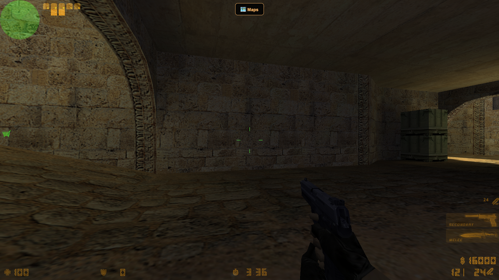
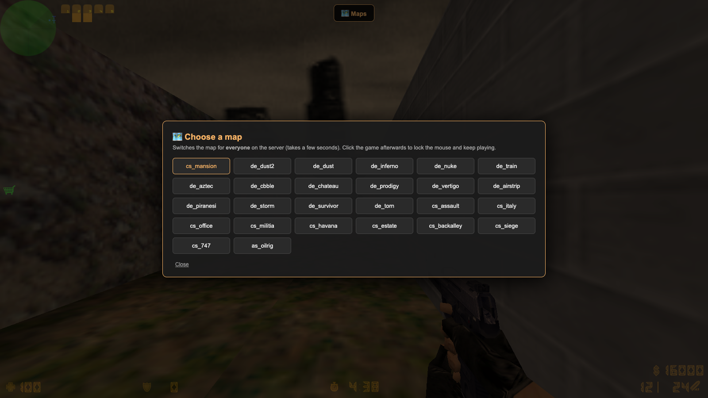
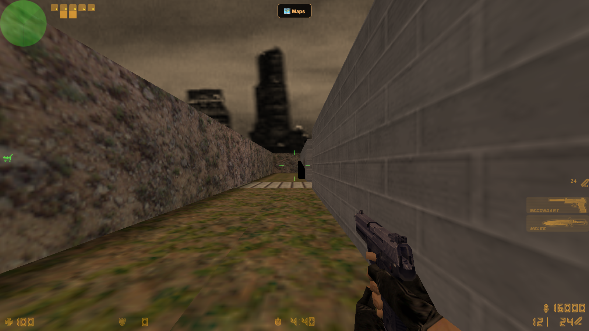

# CS 1.6 in the Browser — LAN Party Server

Counter-Strike 1.6, playable **right in the browser** over your local network — no
installs, no Steam, no downloads for players. The host runs one Docker container;
everyone else just opens a link, types a nickname, and plays.

Built on [Xash3D FWGS (WebAssembly)](https://github.com/yohimik/webxash3d-fwgs) with
browser↔server networking over WebRTC. Everything runs on the host machine — no
internet required once the assets are cached.



### Highlights

| | |
|---|---|
| 🗺 **In-browser map picker** | Switch the map for everyone, mid-game, no console. |
| 💰 **Full arsenal** | Everyone spawns with max money every round. |
| 🏠 **Custom maps** | e.g. `cs_mansion`, fetched and wired in automatically. |
| ⎋ **Polished UX** | `Esc` opens the map picker instead of a broken engine menu. |

<table>
  <tr>
    <td></td>
    <td></td>
  </tr>
  <tr>
    <td align="center"><em>The in-browser map picker</em></td>
    <td align="center"><em>Custom map: cs_mansion</em></td>
  </tr>
</table>

---

## How to play

**Prerequisites:** just [Docker Desktop](https://www.docker.com/products/docker-desktop/).
The game assets (`valve.zip`, ~400 MB) are **not** shipped in this repo (Valve copyright +
size); on the host's first run `start.sh` builds them automatically from the pinned server
image — no SteamCMD or manual download needed.

**Host OS:** `start.sh` runs on **macOS and Linux** natively, and on **Windows via WSL2**
(or Git Bash) — it's a bash script and won't run in native cmd/PowerShell. **Players** join
from any OS in any modern browser; only the host runs the script.

```bash
cd cs16-web
./start.sh
```

`start.sh` starts Docker if needed, builds the patched web client, builds the game
assets (`valve.zip`) from the pinned server image if they're missing, pulls custom maps
on first run, detects the host's LAN IP, writes it into the config, and copies a
ready-to-share link to the clipboard — just paste it into your team chat.

Everyone on the same Wi-Fi/LAN opens the link in Chrome / Edge / Firefox, enters a
nickname, waits for the assets to load (~400 MB on first visit, then cached), picks a
team — and plays. Everyone spawns with **$16000**, so walk into spawn and buy anything.

Stop the server: `./stop.sh`. Live logs: `docker logs -f cs16-web`.

## Running a LAN party in the office

1. **Host machine** — any Mac/PC with [Docker Desktop](https://www.docker.com/products/docker-desktop/)
   installed, on the office Wi-Fi/LAN. This is the only machine that needs setup.
2. **First-time build** of the game content (`valve.zip`) happens automatically on the
   first `./start.sh` — it's extracted from the pinned server image and reused forever
   (no SteamCMD needed). To rebuild it manually, see [Rebuilding `valve.zip`](#rebuilding-valvezip).
3. **Launch:** `./start.sh`. It prints and copies a link like `http://192.168.1.201:27016`.
4. **Share the link** in the team chat. Players just open it — nothing to install.
5. **Firewall:** allow inbound TCP `27016` and TCP/UDP `27018` on the host (macOS will
   prompt once; on Windows allow Docker through the firewall). Everyone must be on the
   **same network** (WebRTC needs direct UDP — guest/AP-isolated Wi-Fi won't work).
6. **Switched networks?** Re-run `./start.sh` — it rewrites the host IP and reshares the link.

Recommended: 16-player default; pick the map from the in-browser picker once people join.

## Changing the map

**From the browser (recommended).** While playing, press **Esc** to free the mouse,
then click the **🗺 Maps** button at the top and choose a map. It switches the map for
**everyone** within a few seconds — then click back into the game to keep playing.
(Internally it sends `rcon changelevel` over the existing connection; the RCON password
lives in `cstrike/server.cfg` and is intentionally public on a LAN.)

**Default map at boot.** Edit `command:` in `docker-compose.yml`
(`["+map", "de_dust2", "+maxplayers", "16"]`) and run `./start.sh`.

## Custom maps (e.g. cs_mansion)

Stock CS 1.6 maps ship inside `valve.zip`. Custom (non-stock) maps are **bundled in the
repo** under `custom-maps/` and mounted into the dedicated server. Because `valve.zip` is
rebuilt locally (not committed), `./add-maps.sh` injects the bundled `.bsp` files into it
so browsers can load them too — `./start.sh` runs this automatically on first launch.

`cs_mansion` is included by default. To add another custom map:

1. drop `<map>.bsp` into `custom-maps/` (or add an `add_map <name> <zip-url>` line to
   `add-maps.sh` to fetch it), mount it in `docker-compose.yml`, and run `./add-maps.sh`,
2. add the map name to the `CUSTOM` array in `web/index.html` so it shows in the picker.

> Custom maps must use stock textures, or bundle their own WAD/textures into `valve.zip`.
> `cs_mansion` uses only stock WADs, so the `.bsp` alone is enough.

## Full arsenal for everyone

`cstrike/server.cfg` sets `mp_startmoney 16000` and a long `mp_buytime`, so every player
can buy the entire arsenal from spawn each round. Tweak those values to taste.

## How it works — the patched web client

The browser client is patched purely through Docker volume mounts; the upstream image is
never modified:

- **`web/index.html`** — adds the map-picker overlay and swallows the **Esc** key before
  it reaches the engine. The engine's own in-game menu renders as a black screen in this
  build (its TTF fonts are missing), so we suppress it; the browser still releases the
  mouse, which reveals the map picker instead. The picker lives in `<head>` and
  self-heals, because the engine rebuilds `<body>` on load.
- **`web/main.js`** — **generated** by `./prepare-client.sh`; a one-line patch exposing
  the engine instance on `window.__xash` so the picker can call `rcon changelevel`.

The upstream bundle's filename is content-hashed inside the image, so the image is
**pinned by digest** in `docker-compose.yml`. If you bump the image, re-run
`./prepare-client.sh` to regenerate `web/main.js` and re-sync the filename.

## Important notes

- **The host IP must match `IP:` in `docker-compose.yml`** (WebRTC requirement);
  `./start.sh` updates it on every launch.
- `sv_lan` must stay `0` in `cstrike/server.cfg` — `1` breaks RCON / the map picker.
- Ports: `27016` (HTTP — game page + signaling), `27018` TCP/UDP (WebRTC game traffic).

### Rebuilding `valve.zip`

`valve.zip` holds the game assets (maps, models, sounds). It is **not** included in this
repo (Valve copyright + size). Normally you don't build it by hand — `./start.sh` extracts
it from the pinned server image automatically on first run. To rebuild it manually from
Valve's free anonymous dedicated-server download (SteamCMD app 90) instead:

```bash
steamcmd +@sSteamCmdForcePlatformType linux +force_install_dir "$(pwd)/hlds" \
  +login anonymous +app_set_config 90 mod cstrike +app_update 90 validate +quit
cd hlds && zip -r ../valve.zip valve cstrike \
  -x "*.so" -x "*.dll" -x "*.exe" -x "*.dylib" -x "valve/dlls/*" -x "*/logs/*"
```

(app 90 is flaky — rerun until it reports success. Do **not** exclude `.lst` files —
the engine crashes on startup without `cstrike/delta.lst`.) After rebuilding, run
`./add-maps.sh` again to re-add the custom maps.

## Project layout

```
docker-compose.yml     # service (image pinned by digest) + volume mounts
start.sh / stop.sh     # launch / stop; start.sh bootstraps client + custom maps
prepare-client.sh      # regenerate the patched web/main.js from the pinned image
add-maps.sh            # download custom maps into valve.zip + custom-maps/
cstrike/server.cfg     # full-money arsenal + RCON password for the map picker
web/index.html         # patched client page: map picker + Esc handling
web/main.js            # generated, gitignored (run prepare-client.sh)
custom-maps/*.bsp      # bundled custom maps, committed (mounted into the server)
valve.zip              # game content, gitignored (rebuild via SteamCMD)
docs/img/              # screenshots
verify.mjs             # headless e2e smoke test (npm i && node verify.mjs)
```

## Playing from outside the LAN

WebRTC needs direct UDP — an HTTP tunnel (ngrok etc.) won't work. Either forward ports
`27016/tcp` + `27018/tcp+udp` on the router (and set `IP:` to the public IP), or join a
VPN (WireGuard/Tailscale) and set `IP:` to the VPN address.

---

## Credits & attribution

- **Counter-Strike** and **Half-Life** — game, maps, models, sounds and all related
  assets are © **Valve Corporation**. This project is **not affiliated with or endorsed
  by Valve**. Game content (`valve.zip`) is **not** redistributed here; it is downloaded
  on the host from Valve's own anonymous SteamCMD servers.
- **Engine & web client** — [Xash3D FWGS](https://github.com/FWGS/xash3d-fwgs) and the
  [webxash3d-fwgs](https://github.com/yohimik/webxash3d-fwgs) WebAssembly port and Docker
  image (`yohimik/cs-web-server`) by **yohimik**. All credit for the in-browser engine
  goes to those projects; please refer to their repositories for their licenses.
- **`cs_mansion`** — community-made custom map, bundled in `custom-maps/` (originally
  obtained from a public mirror, [DS-Servers](https://ds-servers.com)). All rights to the
  map remain with its original author; it is included here only for convenient LAN play.
- Apart from this one community map, the repository contains only configuration, scripts,
  a small client patch, screenshots, and documentation. It ships **no** Valve content.

## Disclaimer — no warranty, no liability

This project is provided **"as is", without warranty of any kind**, express or implied,
including but not limited to the warranties of merchantability, fitness for a particular
purpose and non-infringement. In no event shall the author be liable for any claim,
damages or other liability arising from, out of, or in connection with the software or
its use.

It is an **unofficial, hobby/educational tool** for running a private LAN game among
people who own Counter-Strike. It is not affiliated with Valve, FWGS, or yohimik. You
are responsible for ensuring your use complies with Valve's EULA/Steam Subscriber
Agreement and any applicable laws in your jurisdiction. Use at your own risk.
